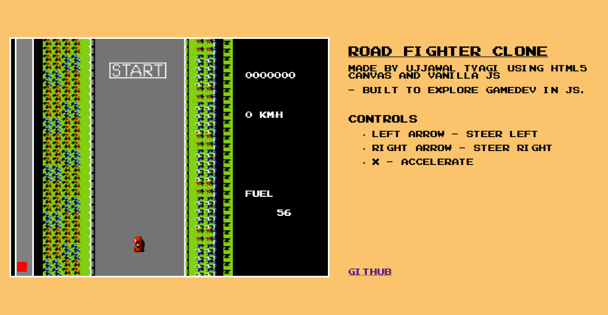
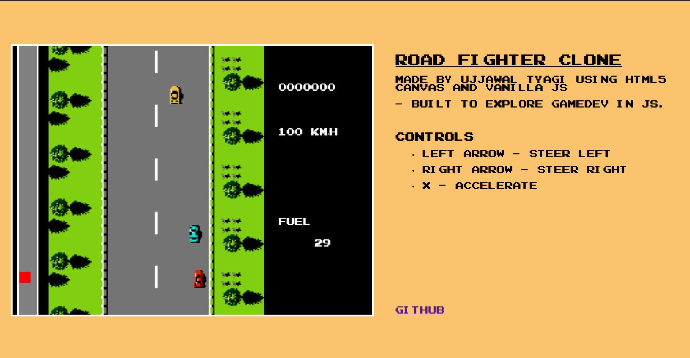

# 🏎 Road Fighter Clone (HTML5 Canvas)

A retro-style arcade racing game built using **vanilla JavaScript** and the **HTML5 Canvas API**.

This project was created to explore core game development concepts in JavaScript — including state management, animation systems, collision detection, and frame-independent movement.

---

## 🎮 Features

- State-based architecture (Menu → Countdown → Running → Win / Game Over)
- Frame-independent movement using delta time
- Smooth acceleration & drag system
- Animated crash explosion (multi-frame)
- Fuel pickup system with sound effects
- Dynamic traffic spawning (enemies + fuel tankers)
- Speed, fuel, and level progress UI
- Finish line detection with win transition

---

## 📸 Screenshots

### 🚗 Gameplay

---

## 🧠 Concepts Practiced

- Game loop structure
- Delta time physics
- Object lifecycle management
- Collision detection (AABB)
- Sprite animation handling
- Modular game states
- Basic audio integration

---

## 🛠 Tech Stack

- HTML5 Canvas
- Vanilla JavaScript (ES6 Modules)
- No external libraries

---

## 🚀 Purpose

Built to explore and understand how arcade-style games work internally — focusing on structure and systems rather than polish.

**Made by Ujjawal Tyagi**  
*(To explore game development in JavaScript)*
